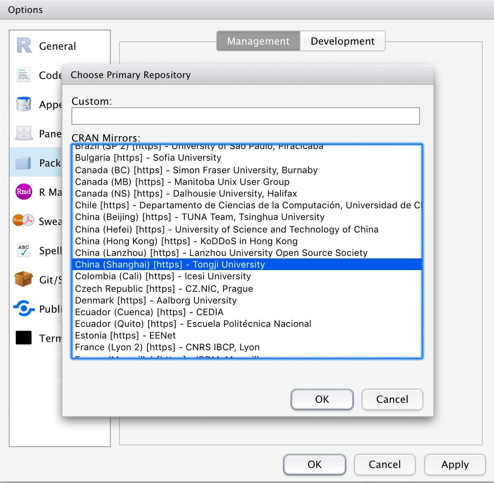

\mainmatter

# R语言及环境配置 {#basis}
在此，我们主要基于R语言，并利用XCMS等关于代谢组学数据处理R包进行示例说明，以此来
介绍非靶向代谢组学中LC-MS数据特点和数据处理方法，因而首先介绍环境配置。

## R语言环境安装
### R语言安装
R语言可于[官方网站](https://cran.r-project.org)下载系统需要的版本，一般选择最新
稳定版本。

- Windows和MacOS系统请直接下载安装文件。
- Linux系统可以使用系统的软件管理程序自动安装或者下载系统对应的二进制文件进行安装
（参见[官方介绍](https://cran.r-project.org/bin/linux/)，也可以通过下载源码包，
自行编译安装。
- Linux通过系统软件管理程序安装代码如下（如果需要安装最新版可能需要安装新的软件
源，具体请搜索查找，在此不再列出）：

```{bash InstallR, eval=FALSE, include=TRUE}
# Ubuntu
sudo apt-get install r-base
# CentOS/Fedora/Redhat
# (for CentOS/Redhat to add EPEL repositories)
sudo yum install epel-release 
sudo yum install R
```

### Rstudio安装
Rstudio是目前市面上最常用的R IDE，利用Rstudio可以方便的进行R包开发和数据分析，
因而推荐使用Rstudio作为主要IDE，
Rstudio可以从[官方网站](https://www.rstudio.com/products/rstudio/download/)选择
系统对应的版本进行下载，且有免费版本使用，一般免费版本已经足够支持基本的开发和
数据分析了

如果习惯使用VIM、Emacs或者Sublime Text，亦可以找到R相关的插件，以便进行开发和
调试，在此不再赘述。

### Rstudio中设置R包安装源
用Rstudio进行R包安装时，默认会使用Rstudio源(https://cran.rstudio.com/)进行安装，
在部分地区和网络下载速度会比较慢，因而可以选择最近的CRAN源进行安装。

选择Tools - Global Options, 在打开的对话框中找到Packages，点击Change进行选择
（Figure \@ref(fig:Rstudio))

```{r Rstudio, echo = FALSE, fig.cap = 'Change CRAN source in Rstudio', out.width='70%'}

```
### Linux/MacOS中安装R缺失库文件
R中有许多R包是调用C/C++开发的，以实现复杂步骤的快速运算，提高运行效率，对这类包
或者部分其他包，在linux或MacOS中进行安装时，会提示无法找到某个lib，这种情况是系
统中缺乏对应依赖的库文件缺失造成的，因而需要安装对应的库文件，然后再安装该R包即可。
具体对于每个提示的缺失的lib，可以搜索对应的Error提示信息和系统信息（如Ubuntu）进行
搜索，即可找到缺失的库文件应该通过安装哪个lib，在此建议使用Google进行搜索，如果
使用百度，请在搜索时使用“R语言”而非“R”。

## 质谱数据分析相关R包安装

### 安装Bioconductor
[Bioconductor](https://www.bioconductor.org)提供了R语言的生物信息软件包，主要用于
生物数据的注释、分析、统计、以及可视化等，最新版本的安装可以参考[官方说明](https://www.bioconductor.org/install/)
```{r Biocunductor, eval=FALSE, include=TRUE}
if (!requireNamespace("BiocManager", quietly = TRUE))
    install.packages("BiocManager")
BiocManager::install()
```
新版本的BiocManager包中install方法可以安装Bioconductor中的R包，亦可以安装CRAN中的
R包，因而可以统一使用该方法进行R包安装。

如果是旧版本的R，或者安装旧版本的Biocunductor，请按照一下操作
```{r Biocunductor_old, eval=FALSE, include=TRUE}
source("https://bioconductor.org/biocLite.R")
biocLite("BiocInstaller")
BiocInstaller::biocLite()
```
### 安装XCMS及CAMERA包
```{r xcms, eval=FALSE, include=TRUE}
library(BiocManager)
install(c('xcms', 'CAMERA'))
```

## 数据准备
在此，进行质谱数据处理的样例数据，放在GitHub的[yddream/MSAnalysis](https://github.com/yddream/MSAnalysis)
Repository的data文件夹里，可以克隆本Repository，直接运行Rmd文件，或者单独下载进行分析。

