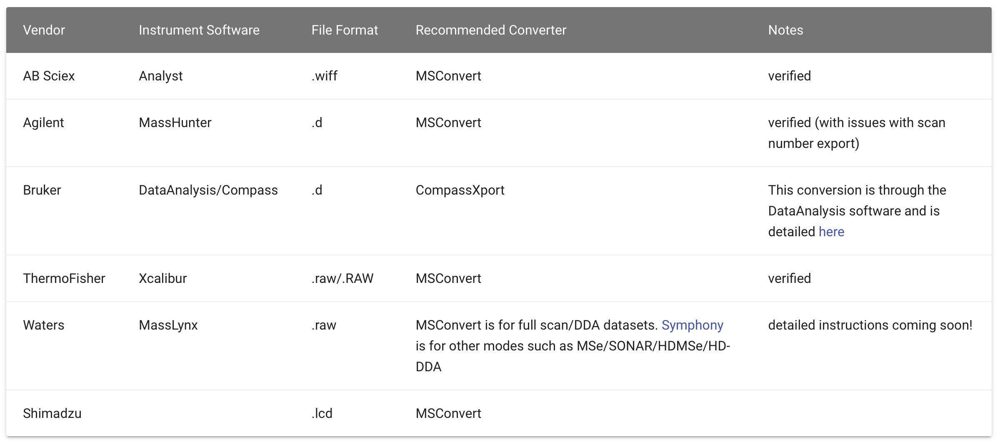
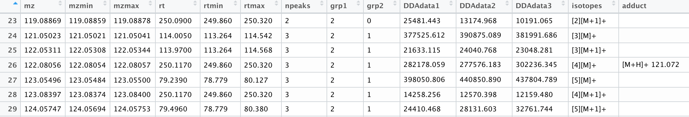

# 基于XCMS的峰检测{#chapPD}

## LC-MS中峰检测简介
在LC-MS中，每一个色谱峰（peak）代表一个代谢物，峰检测(peak detection或peak spotting)
主要目的是检测样品中存在的代谢物，并将多个样品中属于同一个代谢物的色谱峰归类到一起
（称之为峰分组（peak grouping），分组之后的代表多个样品中同一个代谢物峰组称之为一个
feature）。

目前，最常用的峰检测算法是centWave，该算法灵敏度高，可以自动对峰宽在指定范围内利用
小波分析进行判断，从而判定峰的位置和起止点，但该方法在峰的起止点的判定上由于其算法的
局限性，并不能做到非常准确的判断。

峰分组是在单个样品峰检测的基础上，考虑保留时间（RT）漂移等因素，对属于同一个代谢物
的峰进行分组，在峰分组之前需要峰对齐（peak alignment），在xcms中最常用的峰对齐方法
是Obi-Warp，该方法利用采集到的样品数据中的mz，intensity和RT信息进行全局三维对齐，
对齐之后的RT用于峰分组。一般xcms中常用峰密度分布（group.density）方法进行分组。

在LC-MS的峰检测过程中，但样品的峰检测、跨样品的RT校正（峰对齐）和分组是非常重要且
必不可少的过程，缺少任何一步，都会对数据处理质量造成影响，而在某些特定条件下，
Obi-Warp方法会失效，因而在数据处理时要注意看xcms反馈的提示信息，并绘制RT漂移的曲线
方便检查数据是否进行了正确的RT校正。

## 原始数据转换
MS采集的数据，不同的仪器厂商有不同的数据记录方式，而利用XCMS等数据处理软件进行处理
之前，需要将原始数据转换为通用的软件支持的格式，xcms支持xml、mzData、mzXML、mzML、
netCDF等数据格式，因而在利用xcms进行数据处理之前，需要对于质谱采集的原始数据进行
格式转换，一般可使用ProteoWizard等,具体可以参考[GNPS的文档介绍](https://ccms-ucsd.github.io/GNPSDocumentation/fileconversion/)，
在此不再赘述。目前ProteoWizard数据转换支持情况可参见Figure \@ref(fig:datacovert)[@dtcoversion]

```{r datacovert, echo = FALSE, fig.cap = 'Converting data to MZML/MZXML using ProteoWizard[@Wang:2019ig]'}

```

## 利用XCMS进行峰检测

xcms峰检测有两种方法，一种是在xcms3中新近出现的findChromPeaks方法，该方法有很多
新的功能和特性，并方便借用xcms内部的绘图方法，但目前其输出数据格式与其他的常用软件
（如CAMERA）兼容性问题；另一种是传统的xcmsSet方法，由于历史积累和相关软件更新，该
方法目前使用仍较为广泛。以下分别介绍xcms中峰检测的findChromPeaks和xcmsSet方法

### xcms3中峰检测的新方法
xcms3的官方文档中有非常详细的数据处理方法的介绍，其中[*LCMS data preprocessing and analysis with xcms*](https://bioconductor.org/packages/release/bioc/vignettes/xcms/inst/doc/xcms.html#6_correspondence)中介绍了如何利用xcms3的新方法进行一级质谱数据处理。

#### 数据导入
```{r load_new, eval=TRUE, message=FALSE, warning=FALSE, include=TRUE, cache=TRUE}
require(xcms)
require(RColorBrewer)
## Get the full path to the data files(mzxml)
files <- list.files('Data', pattern = '(?i)mzxml$',
                    full.names = TRUE, recursive = TRUE)
## Create a phenodata data.frame
pd <- data.frame(sample_name = sub(basename(files),
                                   pattern = ".mzXML", 
                                   replacement = "",
                                   fixed = TRUE),
         sample_group = c(rep("grp1", 2), rep("grp2", 1)),
         stringsAsFactors = FALSE) 
rawData <- readMSData(files = files, 
                      pdata = new("NAnnotatedDataFrame", pd),
               mode = "onDisk") 
pd
```
- 注：readMSData是MSnbase包中读取质谱数据的方法，返回结果为一个属于‘OnDiskMSnExp’
类的对象。

#### 利用centWave算法进行峰检测
```{r pd_new, eval=TRUE, message=FALSE, warning=FALSE, dependson=c('load_new'), include=TRUE, cache=TRUE}
# xcms 3 new methods
cwp <- CentWaveParam(peakwidth = c(5, 50),
                     noise = 1000, snthresh = 10)
xdata <- findChromPeaks(rawData, param = cwp) 
head(xdata@msFeatureData$chromPeaks)
```
下图展示检测到的一个峰的示例（Figure \@ref(fig:pd_showPeaks)）和在样品中的EIC信息（Figure \@ref(fig:pd_showEIC)）

```{r pdshowPeaks, eval=TRUE, message=FALSE, warning=FALSE, dependson=c('pd_new'), include=TRUE, cache=TRUE, fig.cap = 'Extracted ion chromatogram for one peak'}
## Define the rt and m/z range of the peak area
rtr <- c(375, 400)
mzr <- c(132.07604, 132.07639)
## extract the chromatogram
chrRaw <- chromatogram(xdata, mz = mzr, rt = rtr)
cls <- paste0(brewer.pal(3, "Set1")[1:2], "60")
names(cls) <- c("grp1", "grp2")
plot(chrRaw, col = cls[chrRaw$sample_group], peakBg = cls[chrRaw$sample_group])
```

```{r pdshowEIC, eval=TRUE, message=FALSE, warning=FALSE, dependson=c('pdshowPeaks'), include=TRUE, cache=TRUE, fig.cap='Visualization of the raw MS data for one peak'}
library(magrittr)
# plot EIC/XIC
xdata %>%
    filterRt(rt = rtr) %>%
    filterMz(mz = mzr) %>%
    plot(type = "XIC")
```

#### 峰对齐及分组(peak alignment & grouping)

同一代谢物在不同样品的流出时间会略有差异，因而对于峰检测的结果需要进行对齐(alignment)并将不同样品中的统一代谢物分到各自可以表征该代谢物的峰组(peak group)中(代谢组学中一般成为feature)，从而进一步比较不同样品间统一代谢物的含量。通常我们可以使用'obiwarp'算法进行peak alignment，然后利用'density'算法进行peak grouping.
```{r pkgrp_new, eval=TRUE, message=FALSE, warning=FALSE, dependson=c('pd_new'), include=TRUE, cache=TRUE}
## Correspondence: group peaks across samples.
pdp <- PeakDensityParam(sampleGroups = xdata$sample_group,
            minFraction = 1)
xdata <- groupChromPeaks(xdata, param = pdp)
## Now the retention time correction.
pgp <- PeakGroupsParam(minFraction = 1)
## Get the peak groups that would be used for alignment.
# (grouping with 'peakgroup' method)
xdata <- adjustRtime(xdata, param = pgp)
# otherwise, one can also use 'Obi-warp' method for alignment
xdata <- adjustRtime(xdata, param = ObiwarpParam(binSize = 0.1))
## Grouping with RT corrected peaks 
pdp <- PeakDensityParam(sampleGroups = xdata$sample_group,
                        minFraction = 0.4, bw = 20)
xdata <- groupChromPeaks(xdata, param = pdp)
```

####峰补齐(filling gaps)
对于峰检测过程中会有部分feature在某些样品中未检出对应代谢物峰的清醒，xcms可以根据已检出feature的信息，在相应样品中强行提取EIC信息，从而计算该代谢物在该样品中的含量信息，我们一般称之为filling gaps
```{r fillgap_new, eval=TRUE, message=FALSE, warning=FALSE, dependson=c('pkgrp_new'), include=TRUE, cache=TRUE}
xdata <- fillChromPeaks(xdata)
```

### xcms中传统的峰检测方法
```{r xcmsOld, eval=TRUE, message=FALSE, warning=FALSE, include=TRUE, cache=TRUE, fig.cap = 'RT correction plot'}
require(xcms)
## Get the full path to the data files(mzxml)
files <- list.files('Data', pattern = '(?i)mzxml$',
                    full.names = TRUE, recursive = TRUE)
xdata <- xcmsSet(files, method = 'centWave',
                 peakwidth = c(5, 50), noise= 1000, snthr = 10)
# peak alignment & groups
# peakgroups method
# xdata <- xcms::group(xdata, minfrac = 1)
# xdata<- retcor(xdata, method = 'peakgroups', plottype = 'deviation')
# or obiwarp method
xdata<- retcor(xdata, method = 'obiwarp', plottype = 'deviation',
               profStep = 0.1)
xdata<- xcms::group(xdata, bw = 20, minfrac = 1)
# fill gaps
xdata <-fillPeaks(xdata)
# saveRDS(xdata, file = "Data/xset.Rda")
```

###补充说明
findChromPeaks是xcms中用于进行峰检测的新方法，输入值为'OnDiskMSnExp'对象和峰检测参数对象，CentWaveParam用以创建'CentWaveParam'对象，该对象设置使用'centWave'算法进行峰检测时所需要的参数，其中比较常用的参数如下：
- ppm -- 峰检测时MS1的m/z tolerance，以ppm为单位
- peakwidth -- 长度为2的向量，设置峰检测时峰宽范围，事实上该参数对应的每个峰可以跨越多少个质谱检测的scan，而非多少秒
- snthresh -- 峰检测时信噪比要求
- return.type -- 返回数据类型，可以根据要求返回'XCMSnExp'类数据（默认）、传统的'xcmsSet'类以及'list'

xcmsSet是xcms中可以用于峰检测的传统方法，使用method参数设置峰检测算法，另外根据不同的峰检测算法可以设置该算法需要的参数，详情请参考xcms官方文档。其中'centWave'算法所对应的参数与'CentWaveParam'设置基本一致。

峰检测时除了可以使用centWave算法外，还可以使用其他算法，如'centWaveWithPredIsoROIs'、'massifquant'、'matchedFilter'、'MSW'等，分别对应'CentWavePredIsoParam'、'MassifquantParam'、'MatchedFilterParam'、'MSWParam'参数设置，详情请参考xcms官方文档或者使用R help

## 利用CAMERA进行峰注释

借助LC-MS技术检测得到的代谢物峰包含了大量的同位素峰和加合物峰信息，对数据的进一步造成一定干扰，因而做好同位素和加合物峰的注释对代谢组学数据分析具有重要的辅助作用。常见的注释工具有CAMERA和RAMCluster等，在这里主要介绍基于CAMERA的代谢物峰注释基本操作和其中的一些注意事项。

### CAMERA包介绍
CAMERA是一个Bioconductor R包，主要用于LC-MS数据中代谢物峰的注释，从而标记峰与峰之间的同位素和加合物关系，
具体原理请参考Carsten Kuhl等人2012年发表于分析化学(Analytical Chemistory)上的文章[@Kuhl:2011fy]。
该R包具体相关信息可以参考[Bioconductor网站](https://bioconductor.org/packages/release/bioc/html/CAMERA.html)，关于利用CAMERA进行注释的详细方法和例子可以参考[最新文档](https://bioconductor.org/packages/release/bioc/vignettes/CAMERA/inst/doc/CAMERA.pdf)，

#### 注释前的预备工作

峰检测完成后则可以开始CAMERA注释的操作了。在正式注释同位素和加合物峰之前，需要对峰检测数据进行进一步的处理，创建CAMERA注释对象，并进行分组并检验分组结果

```{r prepareCMR, eval=TRUE, message=FALSE, warning=FALSE, dependson=c('pkgrp_new'), include=TRUE, cache=TRUE}
require(CAMERA)
#Create an xsAnnotate object
xa <- xsAnnotate(xdata)
#Group after RT value of the xcms grouped peak
xag <- groupFWHM(xa, perfwhm=0.6)
#Verify grouping
xac <- groupCorr(xag)
```

#### 同位素峰注释

```{r isotopeCMR, eval=TRUE, message=FALSE, warning=FALSE, dependson=c('prepareCMR'), include=TRUE, cache=TRUE}
#Annotate isotopes, could be done before groupCorr
xac.isotope <- findIsotopes(xac)
```

#### 加合物峰注释

在同位素峰注释完成之后，才可以进行加合物峰的注释。

```{r addu, eval=TRUE, message=FALSE, warning=FALSE, dependson=c('prepareCMR', 'isotopeCMR'), include=TRUE, catch = TRUE}
#Annotate adducts
xac.addu <- CAMERA::findAdducts(xac.isotope, polarity="positive")
```

在这里需要注意的是，加合物的注释可以自己给定加合物注释的规则(rules)。事实上，CAMERA本身内置了非常多的加合物形式的规则，但对于不同的LC体系，产生的加合物形式会有所不同，因而，对于特定的实验来说，最好根据大家对实验中采用的LC体系的了解，自己制定针对性的注释规则。对于CAMERA中的加合物注释规则，大家可以使用以下代码提取，在自己制定规则的时候，可以用做参考。

```{r rules, eval=TRUE, message=FALSE, warning=FALSE, include=TRUE, catch = TRUE}
# list all rule files (for positive/negative modes, primary/extende rules)
files <- list.files(system.file('rules', package = "CAMERA"), full.names = TRUE)
# show head lines of sample rule
head(read.csv(files[4]))
```
对于以上每一列表示的具体含义，可以参考使用文档‘Create rule table’章节（Bioconductor v3.9 在14页，[Section 6](https://bioconductor.org/packages/release/bioc/vignettes/CAMERA/inst/doc/CAMERA.pdf)）

如果需要使用自定义的规则，请参考以下代码：

```{r rules_mod, eval=TRUE, message=FALSE, warning=FALSE, dependson=c('rules', 'isotopeCMR'), include=TRUE, catch = TRUE}
my.rules <- read.csv(files[4])
xac.addu <- CAMERA::findAdducts(xac.isotope, rules = my.rules, polarity="positive")
```

注：polarity请根据自己实验采集数据时的离子模式正确设置，在不设置自定义规则的时候，CAMERA会调用内置的与该离子模式相同的规则（包含primary和extended）进行注释。

#### 注释结果表格输出

```{r output, eval=TRUE, message=FALSE, warning=FALSE, dependson=c('addu'), include=TRUE, catch = FALSE, fig.cap="Example of CAMERA annotation results"}
#Get final peaktable and store on harddrive
res.anno <- CAMERA::getPeaklist(xac.addu)
saveRDS(res.anno, file = "Data/AnnoRes.Rda")
# write.csv(res.anno,file="Result.csv")

```
Figure \@ref(fig:DDAvsDIA)展示了CAMERA注释的结果，对于adduct列，我们看到的最后部分的数字表示该加合物形式对应的M的质荷比，方括号内显示的是M的加合物形式，方括号后面的‘+’号则表示该加合物形式的电荷数量。而同位素注释结果中最前面的方括号表示该同位素所对应的id，id相同的峰为同一个M峰的不同同位素峰，第二个方括号中的M+x表示同位素峰中的同位素情况，方括号外面的内容则表示电荷情况。pcgroup列则是在预处理时CAMERA生成的group信息

### 小结
峰检测是质谱数据处理的基础，利用峰检测可以获取样品中检测到的信号的基本信息，如mz、RT、峰面积等，这些信息是代谢物鉴定和差异分析的基础，利用xcms进行峰检测，并借助于CAMERA进行峰注释，可以有效的检测到样品中含有的代谢物信息，并去除部分冗余。除了xcms，还有很多同样优秀的质谱数据处理分析的软件，如OpenMS，MZmine 2 ，MS-DIAL等，在此暂不做详细介绍，如有兴趣请参考相应软件的官方说明。
